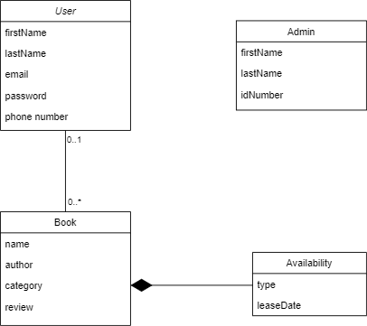

# Bookstore Library & Stock keeping app

This is an online library mamangement app where users can rent books for a specific time, like them and can also review books. This will have 2 interfaces .

User Inerface
Admin Interface
Users registered for this application can :

- browse books from the library
- filter them based on category, author, publications etc..
- Pay & Rent them for a specific duration
- Like/Review them

Admin of this application can :

- List/manage books
- Track rented books and their availability
- Send notifications via email to users once lease expires

