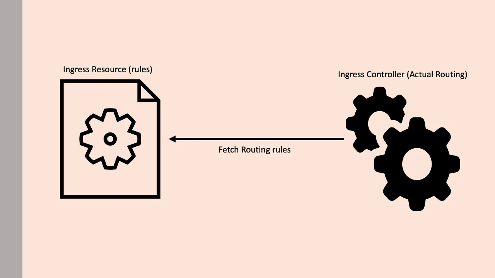
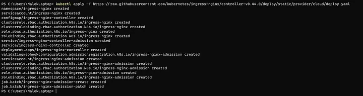
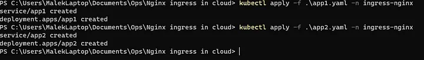

This document describes how to install the NGINX Ingress Controller in your Kubernetes cluster using kubectl .

# What is Ingress ?

Ingress is a native Kubernetes resource like pods, deployments, etc. Using ingress, you can maintain the DNS routing configurations. The ingress controller does the actual routing by reading the routing rules from ingress objects stored in etcd.

# Before Ingress ?

Before the Kubernetes Ingress was stable, a custom Nginx or an HAproxy kubernetes deployment would be exposed as a Loadbalancer service for routing external traffic to the internal cluster services.

# Kubernetes Ingress : How it works?


Actual Ingress relies on two concepts

- Kubernetes Ingress Resource: Kubernetes ingress resource is responsible for storing DNS routing rules in the cluster.

- Kubernetes Ingress Controller: Kubernetes ingress controllers (Nginx/HAProxy etc.) are responsible for routing by accessing the DNS rules applied through ingress resources.



## Setup

First, we will understand all the associated Kubernetes objects by deploying Nginx controllers using YAML manifests. Once we have the understanding, we will deploy it using kubectl.

## Install NGINX Ingress Controller

An ingress controller, because it is a core component of Kubernetes, requires specific configuration to be performed at the cluster level as part of installation. The NGINX project simplifies this by providing a single deployment yaml file that captures all the required steps for the cluster configuration :

```bash
kubectl apply -f https://raw.githubusercontent.com/kubernetes/ingress-nginx/main/deploy/static/provider/cloud/deploy.yaml
```

Output:



## Exposing the NGINX Ingress Controller

The above command will by default expose the NGINX Ingress Controller to the outside world to allow it to start receiving connections.

## Validate the NGINX Ingress Controller

```bash
kubectl get pods --all-namespaces -l app.kubernetes.io/name=ingress-nginx
kubectl get services ingress-nginx-controller --namespace=ingress-nginx
```


## Exposing Services using NGINX Ingress Controller

Now we will be wirting the Ingress manifest :

```yaml
apiVersion: networking.k8s.io/v1
kind: Ingress
metadata:
 name: hello-world
 annotations:
 kubernetes.io/ingress.class: "nginx"
 nginx.ingress.kubernetes.io/rewrite-target: /
spec:
 rules:

- http:
  paths:
- pathType: Exact
  path: /bookstore
  backend:
  service:
  name: app1-svc
  port:
  number: 80
- pathType: Exact
   path: /library
   backend:
   service:
   name: app2-svc
   port:
   number: 80
```

## Testing out things :

After deploying our applications manifests :


We can go the LoadBalancer IP and test things :


and the bookstore :


So, to conclude, we demonstrated how to successfully deploy an Ingress controller in Azure Kubernetes Service and serve two ClusterIP services in the cluster .
